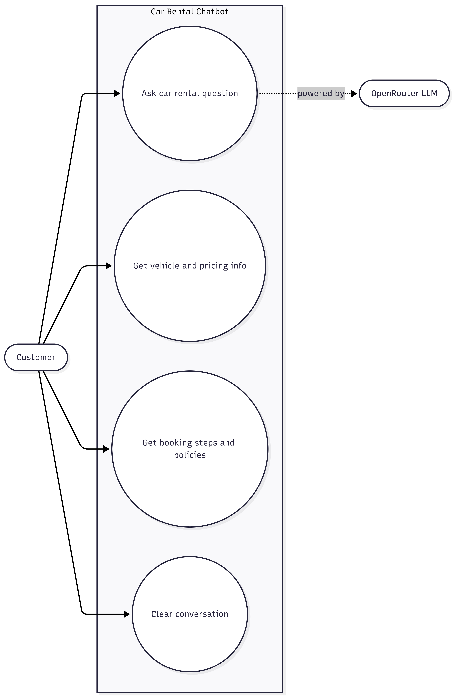
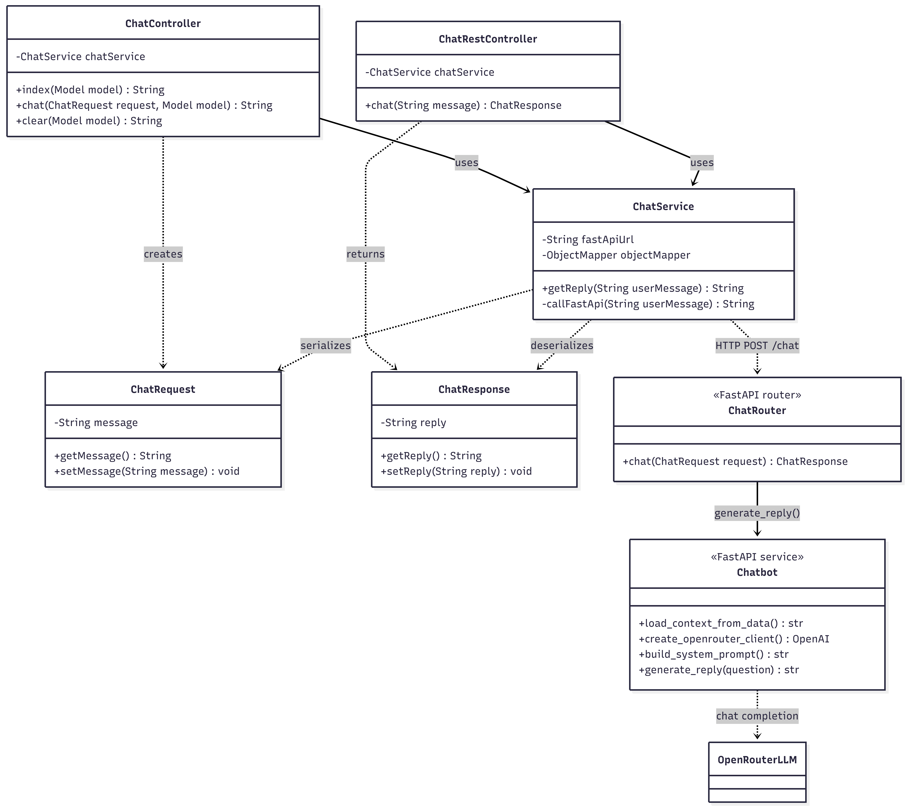
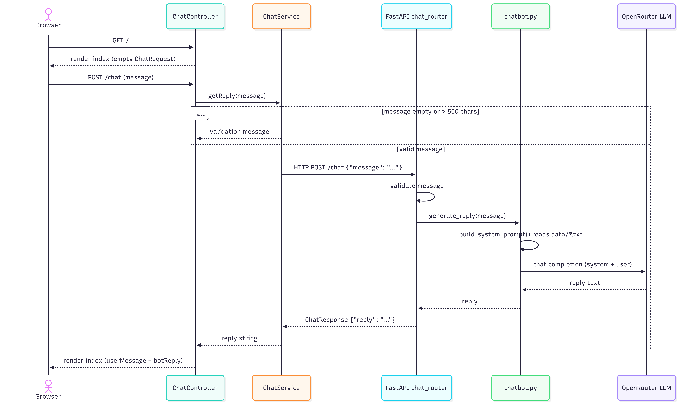

# Spring Boot + FastAPI Chatbot Demo

## Overview

A demo where a Spring Boot web app with AI replies using a Python FastAPI service that calls an LLM (OpenRouter or local Ollama).

Tech stack:

- **Spring Boot** - web app and MVC controllers
- **Thymeleaf** - renders the HTML chat page
- **FastAPI + uvicorn** - the Python AI service
- **LLM** - OpenRouter or local Ollama (`llama3`)

## Run

### 1. FastAPI + Spring Boot

Install the Python dependencies once, then start both services.

#### Terminal 1 - FastAPI (port 8000):

**Option A — OpenRouter** (requires an API key):

```powershell
cd fastapi-llm-service
python -m pip install -r requirements.txt
$env:OPENROUTER_API_KEY="your_openrouter_key"
py main.py
```

**Option B — Local Ollama** (no API key):

Prerequisites: install [Ollama](https://ollama.com), pull a model, and make sure it is running.

```powershell
ollama pull llama3   # one-time download
```

```powershell
cd fastapi-llm-service
python -m pip install -r requirements.txt
py main.py
```

> **Switching between OpenRouter and Ollama:** the chatbot auto-detects the provider. If `OPENROUTER_API_KEY` is set it uses OpenRouter; if the key is not set it falls back to local Ollama.

To use a different Ollama model, open `services/chatbot.py` and change the `model = "llama3"` line in `create_client()` (e.g. `model = "mistral"`), then pull it first with `ollama pull mistral`. Ollama exposes an OpenAI-compatible API on `http://localhost:11434/v1`, so no extra dependencies are needed.

#### Terminal 2 - Spring Boot (port 8080), from the project root:

```powershell
.\mvnw.cmd spring-boot:run
```

Then open:

```text
http://localhost:8080
```

Ports:

```text
8080 = Spring Boot web app (open this in your browser)
8000 = FastAPI AI service (Spring Boot calls it internally)
```

### 2. Direct access to FastAPI (no Spring Boot)

You can call the chatbot directly against FastAPI and skip the Spring Boot layer. Start only Terminal 1 (either option above), then:

- Open the built-in Swagger UI at `http://localhost:8000/docs` and try the `POST /chat` endpoint interactively.
  1. Click POST bar
  2. Click `Try it out`
  3. In `Edit Value`, type your message to replace `string` inside
        ```JSON
        {
            "message": "string"
        }
        ```
  4. Click `Execute`

- Or use **Postman**:
  1. Create a new request.
  2. Set method to **POST** and URL to `http://localhost:8000/chat`.
  3. Open the **Body** tab, choose **raw** and **JSON**.
  4. Enter:
  ```json
  {
    "message": "How much is an SUV?"
  }
  ```
  5. Click **Send**. You should get a JSON response like:
  ```json
  {
    "reply": "..."
  }
  ```
- Or call the chatbot logic with no web server at all via the CLI block. The same file auto-detects the provider based on whether `OPENROUTER_API_KEY` is set:

  **OpenRouter:**
    ```powershell
    $env:OPENROUTER_API_KEY="your_openrouter_key"
    py fastapi-llm-service/services/chatbot.py
    ```
  **Local Ollama:**
    ```powershell
    py fastapi-llm-service/services/chatbot.py
    ```

### 3. JSON API access

`ChatRestController.chat()` (`ChatRestController.java`) exposes `GET /api/chat?message=hello`, which calls the same `ChatService.getReply()` but returns raw JSON instead of an HTML page. Useful for testing the backend without the form.

Example (Spring Boot must be running):
Go to
```powershell
"http://localhost:8080/api/chat?message=YOUR_MESSAGE"
```

Response:

```json
{
  "reply": "..."
}
```

## Repo structure

```text
src/main/java/                 Spring Boot code (controllers, service, models)
src/main/resources/templates/  Thymeleaf HTML page
src/main/resources/data/       Text files used as chatbot context
fastapi-llm-service/           FastAPI app (main.py, routers, services)
```

Key files:

```text
ChatController.java         Spring MVC controller (serves HTML, handles form)
ChatRestController.java     Spring REST controller (JSON API at /api/chat)
ChatService.java            Validates input, calls FastAPI over HTTP
ChatRequest / ChatResponse  Shared request/response models (Java + Python)
main.py                     FastAPI entry point (starts uvicorn)
routers/chat_router.py      FastAPI /chat endpoint
services/chatbot.py         Builds the prompt and calls the LLM (OpenRouter or Ollama)
```

## Flow

1. **Browser loads the page.** A `GET /` request hits `ChatController.index()` (`ChatController.java`), which adds an empty `ChatRequest` to the model and returns the `index` Thymeleaf template.
2. **User submits the form.** The chat form sends `POST /chat` with the typed message. `ChatController.chat()` (`ChatController.java`) receives it as a `ChatRequest`.
3. **Controller calls the service.** `ChatController.chat()` calls `ChatService.getReply(message)` (`ChatService.java`).
4. **Service validates input.** `ChatService.getReply()` rejects empty messages and messages longer than 500 characters before making any network call.
5. **Spring calls FastAPI over HTTP.** The private `ChatService.callFastApi()` (`ChatService.java`) serializes a `ChatRequest` to JSON (`{"message": "..."}`) and sends an HTTP `POST` to the FastAPI URL from `ai.local.url` (`http://localhost:8000/chat`).
6. **FastAPI receives the request.** `chat()` in `chat_router.py` validates the message and calls `generate_reply(message)`.
7. **Python builds the prompt.** `build_system_prompt()` in `chatbot.py` calls `load_context_from_data()` to read every `*.txt` file in `src/main/resources/data` and embeds it as context, defining the car-rental assistant role and rules.
8. **LLM generates the answer.** `generate_reply()` in `chatbot.py` sends the system prompt plus the user message to the OpenRouter model (`meta-llama/llama-3-8b-instruct`) and returns the reply text.
9. **FastAPI returns JSON.** `chat()` in `chat_router.py` wraps the reply in `ChatResponse` (`{"reply": "..."}`) and responds to Spring Boot.
10. **Spring parses the response.** `ChatService.callFastApi()` deserializes the JSON into `ChatResponse` and returns the reply string (or an error message if the call failed).
11. **Spring renders the page.** `ChatController.chat()` adds `userMessage` and `botReply` to the model and returns the `index` template; Thymeleaf renders the conversation back to the browser.

## Diagram

### Use Case Diagram


### Class Diagram


### Sequence Diagram

